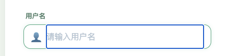
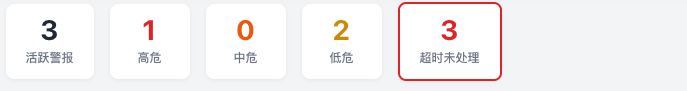

患者端
1. 输入框聚焦之后有一个内边框

2. 密码应该可以控制是否可见
3. 把患者改成天使，亲友改成守护者
4. 近期趋势可以按照今日/本月/本年/全部进行切换
5. 康复计划改成今日计划

亲友端
1. 删除support-miniapp
2. 直接集成在患者端不作为单独的一个端，根据不同帐号展示不同的页面和功能
3. 患者端和亲友端的导航栏要进行区分，他们的角色不同功能不同

后台管理系统
1. 患者应该支持点击该用户可以查看该用户的详细信息，包括该用户的历史聊天记录，历史心情趋势，康复计划等，近期趋势可以按照今日/本月/本年/全部进行切换
2. 内容管理支持上传互联网链接，让用户可以阅读互联网上的文章
3. 紧急服务监控中心上面应该可以点击查看每种类型，每条数据应该可以点击查看对应的用户的详细信息
4. 如果用户访问http://47.239.219.238/admin-web应该自动补全为http://47.239.219.238/admin-web/

